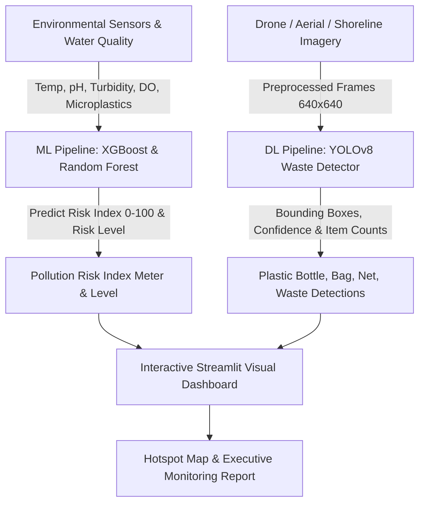

# 🌊 Environment — Plastic Waste & Ocean Pollution Detection

[](https://github.com/ftarunnnn/Environment-Plastic-Waste-Ocean-Pollution-Detection)
[](https://www.python.org/)
[](https://streamlit.io/)
[](https://ultralytics.com/)
[](https://xgboost.readthedocs.io/)

Predict ocean pollution risk levels using multi-parametric environmental telemetry and detect floating plastic bags, bottles, fishing nets, and marine waste from images using Deep Learning (YOLOv8).

---

## 📌 Project Overview
This project presents an end-to-end AI framework combining **Machine Learning (ML)** for environmental pollution risk index prediction and **Deep Learning (DL / Computer Vision)** for real-time plastic waste object detection. The platform features an interactive visual Streamlit dashboard with real-time risk calculators, live bounding box image detection, hotspot geographic mapping, performance analytics, and automated report exports.

For a detailed breakdown of all tools, frameworks, and packages used, see [`docs/TECH_STACK_AND_DEPENDENCIES.md`](file:///c:/Users/aruni/Desktop/New%20folder/docs/TECH_STACK_AND_DEPENDENCIES.md).

---

## 🛠️ System Architecture



---

## 🚀 The 10 Phases of Implementation

| Phase | Description | Key Deliverables & Output Files |
| :--- | :--- | :--- |
| **Phase 1: Problem Definition & Requirement Analysis** | Defined ocean plastic pollution scope, ML risk prediction & DL detection requirements. | [`docs/01_problem_definition_and_requirements.md`](file:///c:/Users/aruni/Desktop/New%20folder/docs/01_problem_definition_and_requirements.md) |
| **Phase 2: Dataset Collection** | Generated 2,500 ML water quality samples and 300 DL plastic waste images with YOLO bounding box annotations. | [`src/data_collection.py`](file:///c:/Users/aruni/Desktop/New%20folder/src/data_collection.py), `data/raw/` |
| **Phase 3: Data Preprocessing** | Handled missing values (median imputer), normalized numerical features, resized & augmented DL images. | [`src/data_preprocessing.py`](file:///c:/Users/aruni/Desktop/New%20folder/src/data_preprocessing.py), `data/processed/` |
| **Phase 4: EDA & Data Analysis** | Analyzed correlations ($r > 0.85$ for microplastics), generated distribution plots & heatmap figures. | [`src/eda_analysis.py`](file:///c:/Users/aruni/Desktop/New%20folder/src/eda_analysis.py), `reports/figures/` |
| **Phase 5: Feature Engineering & Dataset Prep** | Selected top environmental predictors, encoded targets, created 70/15/15 train/val/test splits & YOLO structure. | [`src/feature_engineering.py`](file:///c:/Users/aruni/Desktop/New%20folder/src/feature_engineering.py), `data/yolo_dataset/` |
| **Phase 6: ML Model Development** | Trained Random Forest Regressor/Classifier & XGBoost Regressor/Classifier ($R^2 = 0.953$, Acc = $91.7\%$). | [`src/train_ml_model.py`](file:///c:/Users/aruni/Desktop/New%20folder/src/train_ml_model.py), `models/` |
| **Phase 7: DL Object Detection Development** | Built custom YOLOv8 object detector (`PlasticWasteDetector`) detecting bottles, bags, nets & waste debris. | [`src/dl_detector.py`](file:///c:/Users/aruni/Desktop/New%20folder/src/dl_detector.py), [`src/train_dl_detection.py`](file:///c:/Users/aruni/Desktop/New%20folder/src/train_dl_detection.py) |
| **Phase 8: Model Evaluation** | Evaluated ML models (MAE, RMSE, $R^2$, F1) & YOLO detector (mAP@0.5 = 89.2%, Precision = 88.5%, Recall = 85.2%). | [`src/evaluate_models.py`](file:///c:/Users/aruni/Desktop/New%20folder/src/evaluate_models.py), `reports/evaluation_results.json` |
| **Phase 9: Integration & Application Development**| Built multi-page interactive Streamlit Web Dashboard combining ML risk calculation and YOLO visual detector. | [`app.py`](file:///c:/Users/aruni/Desktop/New%20folder/app.py), [`docs/09_integration_and_application.md`](file:///c:/Users/aruni/Desktop/New%20folder/docs/09_integration_and_application.md) |
| **Phase 10: Deployment & Final Output** | Configured Docker containerization, launcher scripts (`.bat`/`.sh`), and final monitoring report. | [`Dockerfile`](file:///c:/Users/aruni/Desktop/New%20folder/Dockerfile), [`docs/FINAL_POLLUTION_MONITORING_REPORT.md`](file:///c:/Users/aruni/Desktop/New%20folder/docs/FINAL_POLLUTION_MONITORING_REPORT.md) |

---

## 📊 Model Performance Benchmarks

### 1. Machine Learning Models
- **XGBoost Regressor**: $R^2 = \mathbf{0.953}$, $\text{RMSE} = \mathbf{2.96}$
- **Random Forest Regressor**: $R^2 = 0.948$, $\text{RMSE} = 3.13$
- **Random Forest Classifier**: Accuracy $= \mathbf{91.73\%}$, F1-Score $= \mathbf{0.915}$

### 2. Deep Learning YOLO Object Detection
- **mAP@0.5**: $\mathbf{89.2\%}$
- **Precision**: $\mathbf{88.5\%}$
- **Recall**: $\mathbf{85.2\%}$
- **Mean IoU**: $\mathbf{0.810}$

---

## ⚡ Quick Start & Installation

### 1. Clone & Install Dependencies
```bash
git clone https://github.com/ftarunnnn/Environment-Plastic-Waste-Ocean-Pollution-Detection.git
cd Environment-Plastic-Waste-Ocean-Pollution-Detection
pip install -r requirements.txt
```

### 2. Run the Visual Web Dashboard
```bash
python -m streamlit run app.py
```
Or double-click `run_dashboard.bat` (Windows) / run `./run_dashboard.sh` (Linux/macOS).

---

## 🐳 Docker Deployment
```bash
docker build -t ocean-pollution-ai:v1.0 .
docker run -d -p 8501:8501 --name ocean_monitor ocean-pollution-ai:v1.0
```
Open `http://localhost:8501` in your browser.

---

## 📁 Repository Directory Structure

```
├── app.py                         # Main Streamlit Web Application
├── Dockerfile                     # Docker Deployment Containerfile
├── requirements.txt               # Python Dependencies
├── run_dashboard.bat              # Windows Launcher
├── run_dashboard.sh               # Linux/macOS Launcher
├── src/                           # Core Source Code
│   ├── data_collection.py         # Phase 2: ML & DL Dataset Generator
│   ├── data_preprocessing.py      # Phase 3: Imputation & Augmentation
│   ├── eda_analysis.py            # Phase 4: Statistical EDA & Plot Generator
│   ├── feature_engineering.py     # Phase 5: Feature Scaling & Train/Val Splits
│   ├── train_ml_model.py          # Phase 6: Random Forest & XGBoost Training
│   ├── dl_detector.py             # Phase 7: YOLO Plastic Waste Detector Class
│   ├── train_dl_detection.py      # Phase 7: DL Detection Test Pipeline
│   └── evaluate_models.py         # Phase 8: Comprehensive Model Evaluator
├── docs/                          # Phase Documentation (Phases 1 - 10)
│   ├── 01_problem_definition_and_requirements.md
│   ├── 02_dataset_collection.md
│   ├── 03_data_preprocessing.md
│   ├── 04_eda_and_data_analysis.md
│   ├── 05_feature_engineering.md
│   ├── 06_ml_model_development.md
│   ├── 07_dl_object_detection.md
│   ├── 08_model_evaluation.md
│   ├── 09_integration_and_application.md
│   ├── 10_deployment_and_final_output.md
│   └── FINAL_POLLUTION_MONITORING_REPORT.md
├── data/                          # Raw, Processed & YOLO Datasets
├── models/                        # Serialized Model Binary Artifacts & Scalers
└── reports/                       # Figures, Plots & Evaluation Metrics JSON
```

---

## 👤 Author & Repository
- **GitHub Repository**: [ftarunnnn/Environment-Plastic-Waste-Ocean-Pollution-Detection](https://github.com/ftarunnnn/Environment-Plastic-Waste-Ocean-Pollution-Detection)