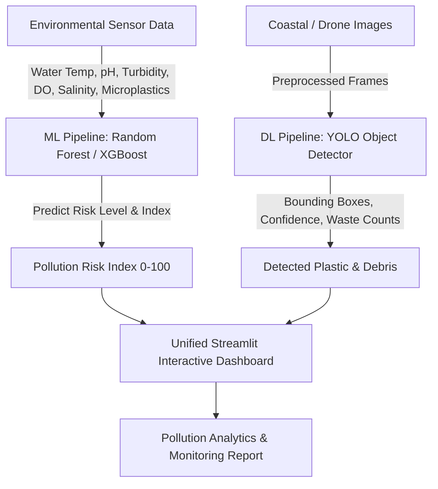

# Phase 1: Problem Definition & Requirement Analysis

## 1. Executive Summary
Ocean and coastal plastic pollution represents one of the most critical environmental threats of the 21st century. Over 11 million metric tons of plastic waste enter global oceans annually, degrading marine ecosystems, disrupting food chains, and impacting coastal economies.

This project implements an end-to-end AI-powered system combining **Machine Learning (ML)** for environmental pollution risk prediction and **Deep Learning (DL / Computer Vision)** for real-time plastic and waste object detection in coastal/marine environments.

---

## 2. Problem Statement & Scope
- **Problem**: Monitoring plastic pollution over vast ocean and coastal areas is manually prohibitive, irregular, and often reactive rather than predictive.
- **Objectives**:
  1. Quantify pollution risk levels using multi-parametric environmental water quality and human activity metrics.
  2. Detect, classify, and count floating plastic bottles, plastic bags, fishing nets, and debris from aerial/underwater images using Deep Learning (YOLO).
  3. Provide a unified interactive visual dashboard for real-time environmental monitoring, risk forecasting, and automated report generation.

---

## 3. System Architecture & Requirements

### 3.1 Machine Learning Requirements
- **Input Features**: Water Temperature (°C), pH Level, Turbidity (NTU), Dissolved Oxygen (mg/L), Salinity (PSU), Microplastic Particle Density (particles/m³), Macroplastic Count (per km²), Coastal Proximity (km), Wave Height (m), Industrial Discharge Score.
- **Output Targets**:
  - `pollution_index`: Continuous pollution score (0 - 100).
  - `pollution_level`: Categorical risk classification (`Low`, `Medium`, `High`, `Critical`).
- **Algorithms**: Random Forest Regressor/Classifier, XGBoost Regressor/Classifier.
- **Target Performance**: R² > 0.90, RMSE < 5.0, Classification Accuracy > 92%, F1-Score > 0.90.

### 3.2 Deep Learning Requirements
- **Input**: High-resolution imagery (aerial, drone, shoreline, underwater).
- **Target Classes**: `plastic_bottle`, `plastic_bag`, `fishing_net`, `other_waste`.
- **Model Architecture**: Ultralytics YOLOv8 / PyTorch Object Detection.
- **Target Performance**: mAP@0.5 > 0.85, Precision > 0.85, Recall > 0.80.

### 3.3 System & Hardware Requirements
- **Operating System**: Windows / Linux / macOS
- **Language & Runtime**: Python 3.10+
- **Core Frameworks**: PyTorch, Ultralytics YOLO, Scikit-Learn, XGBoost, Pandas, OpenCV, Streamlit, Plotly.
