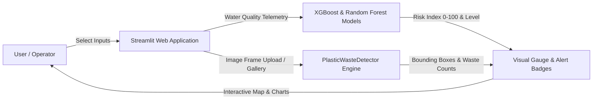

# Phase 9: Integration & Application Development

## 1. System Integration Architecture
Phase 9 integrates the ML water quality pollution predictor and the YOLO deep learning object detection engine into a unified Streamlit dashboard application (`app.py`).

---

## 2. Dashboard Feature Modules (`app.py`)
1. **📊 Executive Overview**: High-level platform KPIs, total sample counters, global pollution averages, and interactive Plotly distributions.
2. **🔮 Real-Time ML Risk Predictor**: Multi-slider environmental sensor panel (temperature, pH, turbidity, dissolved oxygen, microplastics, coastal proximity, industrial discharge) predicting continuous risk score and displaying color-coded gauge meters.
3. **🔍 DL Waste Object Detector**: Image gallery picker and custom file uploader executing YOLO object detection, drawing annotated bounding boxes, and tabulating detected waste items.
4. **🗺️ Hotspot Location Map**: Carto dark-matter interactive map displaying ocean monitoring coordinates.
5. **📈 Model Performance Center**: Centralized display of ML validation metrics ($R^2$, MAE, Accuracy) and YOLO detection charts (mAP, Precision, Recall).
6. **📑 Monitoring Report Generator**: Automated report generator offering instant plain text / Markdown export.
